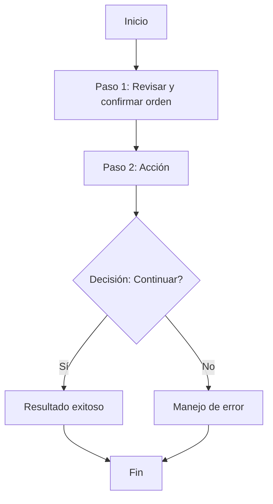

```mermaid
flowchart TD
    A[Inicio] --> B[Paso 1: Revisar y confirmar orden]
    B --> C[Paso 2: Acción]
    C --> D{Decisión: Continuar?}
    D -->|Sí| E[Resultado exitoso]
    D -->|No| F[Manejo de error]
    E --> G[Fin]
    F --> G
```